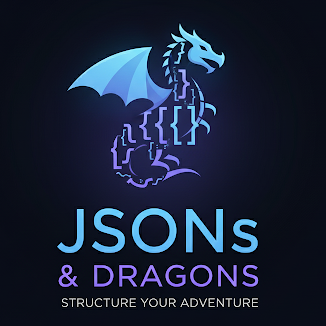

<h1 align="center"> 🐉 JSONs & Dragons (J&D) 🐉  
  
  
  

  
</h1>

Um projeto desenvolvido para a disciplina de Engenharia de Software, com o objetivo de criar um conjunto de ferramentas para enriquecer e agilizar sessões de RPG de mesa presenciais, com foco em Dungeons & Dragons 5ª Edição.

## Grupo: JSONs & Dragons
* **João Victor Assaoka Ribeiro**
* **Lucas Molinari**
* **Thomas Pires Correia**

---

## 🎯 Sobre o Projeto

O "JSONs & Dragons" é um sistema cliente-servidor projetado para rodar em uma rede local (LAN), onde o Mestre utiliza uma aplicação desktop (PC) e os jogadores interagem através de seus celulares.

A aplicação busca automatizar os aspectos tediosos do jogo, como a gestão de fichas e o rastreamento de combate, enquanto amplifica o poder do Mestre, permitindo total controle sobre a narrativa e as regras.

## ✨ Funcionalidades Principais
O escopo do projeto inclui as seguintes funcionalidades essenciais:

* **Ficha de Personagem Digital (Mobile):** Os jogadores gerenciam seus personagens em tempo real, controlando pontos de vida, recursos, magias e inventário.
* **Painel do Mestre (Desktop):** Uma central de controle para o Mestre, permitindo:
    * Visualizar a ficha de todos os jogadores de forma sincronizada.
    * Gerenciar combates, rastreando iniciativa, vida e condições de todos os participantes (jogadores e monstros).
    * Criar e distribuir itens customizados para os jogadores.
* **Comunicação Secreta:**
    * O Mestre pode solicitar testes a um jogador sem que os outros saibam (ex: um teste de Percepção escondido).
    * Um jogador pode comunicar uma intenção secreta ao Mestre (ex: "quero tentar roubar a poção do meu colega").
* **O Poder do Mestre:** O Mestre tem a capacidade de sobrescrever regras e resultados em tempo real sem o conhecimento dos jogadores, garantindo que a experiência de jogo seja sempre a melhor possível.
* **Motor de Homebrew:** A funcionalidade central do projeto. Uma interface que permite ao Mestre criar e gerenciar seu próprio conteúdo (itens, magias, monstros, etc.) através de um sistema de templates. As fichas são **autocontidas**, carregando todas as regras necessárias para funcionar de forma independente.

## 🏛️ Arquitetura Proposta
O sistema funcionará em um modelo **Cliente-Servidor local**:

1.  **Servidor (Aplicação do Mestre):** Rodando em Python, esta aplicação será a **fonte da verdade** de todo o estado do jogo. Ela gerencia as regras, os personagens, o combate e a comunicação. Ela expõe uma API na rede local para os clientes se conectarem.
2.  **Clientes (Apps dos Jogadores):** Aplicações móveis que se conectam ao servidor do Mestre. Elas enviam as "intenções" do jogador (ex: "usar habilidade X") e recebem as atualizações de estado do servidor para exibir na interface.

O coração do sistema será um **motor de regras orientado a dados**. Todas as entidades do jogo (classes, itens, magias, etc.) serão definidas em arquivos **JSON**, permitindo que o sistema seja facilmente expansível com conteúdo *homebrew* sem a necessidade de alterar o código-fonte.
